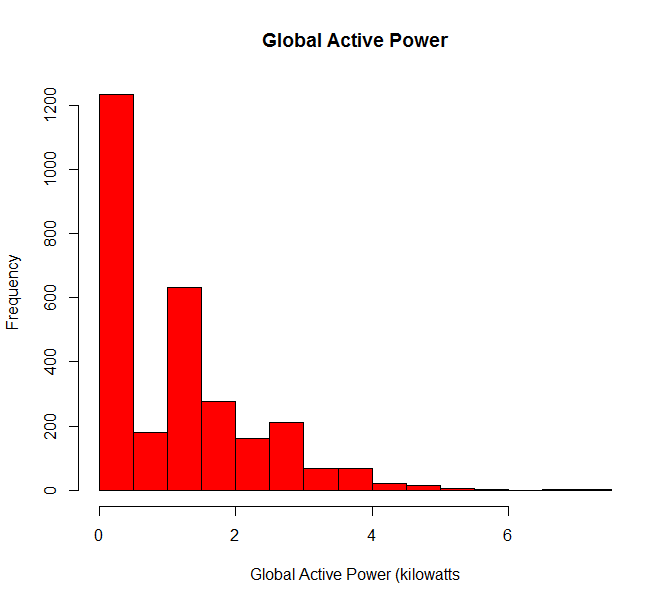
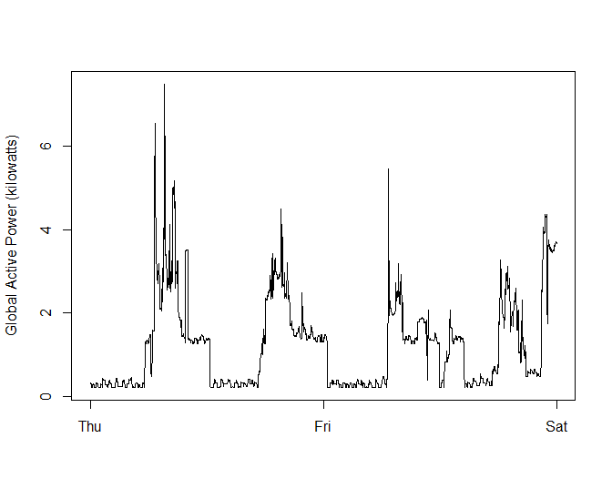
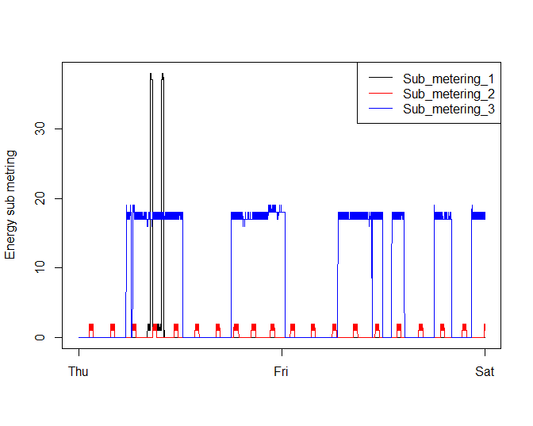
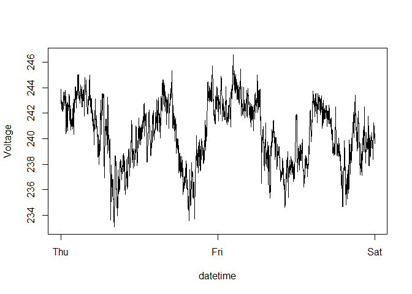
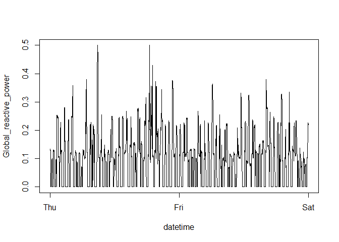
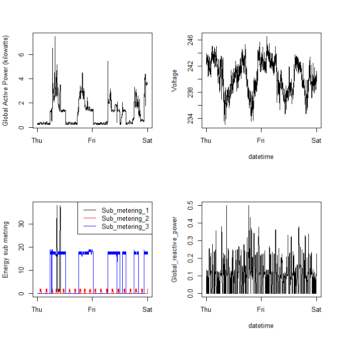

# README


```r
library(dplyr)
library(lubridate)
```


# Instructions for the Assignment

## Review criteria

* Was a valid GitHub URL containing a git repository submitted?
* Does the GitHub repository contain at least one commit beyond the original fork?
* Please examine the plot files in the GitHub repository. Do the plot files appear to be of the correct graphics file format?
* Does each plot appear correct?
* Does each set of R code appear to create the reference plot?

## Plot requirements

For each plot you should:

* Construct the plot and save it to a PNG file with a width of 480 pixels and a height of 480 pixels.

* Name each of the plot files as plot1.png, plot2.png, etc.

* Create a separate R code file (plot1.R, plot2.R, etc.) that constructs the corresponding plot, i.e. code in plot1.R constructs the plot1.png plot. Your code file should include code for reading the data so that the plot can be fully reproduced. You should also include the code that creates the PNG file.

* Add the PNG file and R code file to your git repository


## Calculate the memory requirements for the dataset
> How do we calculate the memory consumption?


# Creating a dataset

## Description of the method
Reading the whole file takes around 3.5 minutes. It is 126.8 MB file for all the 2 millions plus observations and 9 variables. We wouldn't need that amount observations loaded in memory for this assignment.

Instead of loading the whole dataset a subset of it will be loaded. To achieve this, a R script `read_data.R` was written. The script will create a subset of the large dataset constrained only to 2 days of February 2007. 

## Using only 2007 data
We will only be using data from the dates 2007-02-01 and 2007-02-02. One alternative is to read the data from just those dates rather than reading in the entire dataset and subsetting to those dates.

## Code for loading a subset of the large dataset
The script perform these tasks:

* Reads one row of the large dataset.
* Finds the number of variables or columns.
* Read the column with the date that will enable us to select the two days in February 2007.
* Converts that variable from character to `Date` class.
* Finds the number of rows to skip at the top with `which.max()` and the date 01-01-2007.
* Finds the maximum number of rows to read based on the date 01-02-2007.
* A portion of the large data frame is created


Here is the code:


```r
read_2d <- function() {
  # function to read selected rows from large dataset
  
  library(dplyr)
  
  fn <- "./data/household_power_consumption.txt"
  
  # read one row only
  cat("Reading one row of the large dataset \n")
  DF.row1 <- read.table(fn, header = TRUE, nrow = 1, sep = ";")  # read one row and header
  nc <- ncol(DF.row1)      # number of columns
  
  # read one column only
  cat("Reading one column of large dataset \n")
  DF.Date <- read.table(fn, header = TRUE, 
                        as.is = TRUE, 
                        colClasses = c(NA, rep("NULL", nc - 1)), 
                        sep = ";")
  

  # convert Date from character to Date
  cat("convert Date from character to Date\n")
  DF.Date <- DF.Date %>%
    mutate(Date = as.POSIXct(Date, format="%d/%m/%Y"))
  
  # calculate rows to skip and max number of rows to read
  
  n2007_1 <- which.max(DF.Date$Date >= "2007-02-01")
  n2007_2 <- which.max(DF.Date$Date >= "2007-02-03")
  cat("Number of rows to skip:", n2007_1, "\n")
  cat("Maximum number of rows to read:", n2007_2, "\n")
  
  # data frame of 2 days in February 2007
  DF3 <- read.table(fn, 
                    col.names = names(DF.row1), 
                    skip = n2007_1, 
                    as.is = TRUE, 
                    sep = ";", 
                    nrows = (n2007_2-n2007_1)
                    )
  
  cat("Finished reading ", (n2007_2-n2007_1), "rows \n")
  return(DF3)
  
}
```

## Using the script
In the end, 2880 observations by 9 variables is the size of the data frame required for this assignment. The name of the data frame is `power`.


```r
source("read_data.R")

power <- read_2d()
```

```
Reading one row of the large dataset 
Reading one column of large dataset 
convert Date from character to Date
Number of rows to skip: 66637 
Maximum number of rows to read: 69517 
Finished reading  2880 rows 
```

```r
rows <- dim(power)[1]
cols <- dim(power)[2]
cat(sprintf("rows: %d, cols: %d", rows, cols))
```

```
rows: 2880, cols: 9
```
# The subset data frame

## Description of the data frame
The dataset has 2880 observations and 9 variables. It contains only observations for February 01 and February 2 of 2007.


## Class of the variables
At the moment on reading the dataset we indicated `as-is=TRUE`, which facilitates in some way the conversion. Here is a summary of the variables and their classes:


```r
str(power)
```

```
'data.frame':	2880 obs. of  9 variables:
 $ Date                 : chr  "1/2/2007" "1/2/2007" "1/2/2007" "1/2/2007" ...
 $ Time                 : chr  "00:00:00" "00:01:00" "00:02:00" "00:03:00" ...
 $ Global_active_power  : num  0.326 0.326 0.324 0.324 0.322 0.32 0.32 0.32 0.32 0.236 ...
 $ Global_reactive_power: num  0.128 0.13 0.132 0.134 0.13 0.126 0.126 0.126 0.128 0 ...
 $ Voltage              : num  243 243 244 244 243 ...
 $ Global_intensity     : num  1.4 1.4 1.4 1.4 1.4 1.4 1.4 1.4 1.4 1 ...
 $ Sub_metering_1       : num  0 0 0 0 0 0 0 0 0 0 ...
 $ Sub_metering_2       : num  0 0 0 0 0 0 0 0 0 0 ...
 $ Sub_metering_3       : num  0 0 0 0 0 0 0 0 0 0 ...
```
The `Date` and `Time` variables are character classes. The other 7 variables are numeric. 
We will create a new variable `date_time` later as a combination of the Date and Time variables.


## Converting the variable Date and Time to POSIX
We need the date format to be separated with "/" as is it shown in the original variable.
We derive the data frame `power07_2d` from the data frame `power` which was generated at the beginnning.

We will create the variable `date_time`, which will be necessary for the plots. This variable is of the class POSIX formatted as __%d/%m/%Y %H:%M:%S__.


```r
power07_2d <- power %>%
  mutate(date_time = as.POSIXct(
    paste(Date, Time),              # combine the date and time
    format="%d/%m/%Y %H:%M:%S")     # string format to use for the new variable
    )

# a sample of few dates
head(power07_2d$date_time)
```

```
[1] "2007-02-01 00:00:00 CST" "2007-02-01 00:01:00 CST"
[3] "2007-02-01 00:02:00 CST" "2007-02-01 00:03:00 CST"
[5] "2007-02-01 00:04:00 CST" "2007-02-01 00:05:00 CST"
```

```r
tail(power07_2d$date_time)
```

```
[1] "2007-02-02 23:54:00 CST" "2007-02-02 23:55:00 CST"
[3] "2007-02-02 23:56:00 CST" "2007-02-02 23:57:00 CST"
[5] "2007-02-02 23:58:00 CST" "2007-02-02 23:59:00 CST"
```


## A summary of the variables after some transformation

```r
str(power07_2d)
```

```
'data.frame':	2880 obs. of  10 variables:
 $ Date                 : chr  "1/2/2007" "1/2/2007" "1/2/2007" "1/2/2007" ...
 $ Time                 : chr  "00:00:00" "00:01:00" "00:02:00" "00:03:00" ...
 $ Global_active_power  : num  0.326 0.326 0.324 0.324 0.322 0.32 0.32 0.32 0.32 0.236 ...
 $ Global_reactive_power: num  0.128 0.13 0.132 0.134 0.13 0.126 0.126 0.126 0.128 0 ...
 $ Voltage              : num  243 243 244 244 243 ...
 $ Global_intensity     : num  1.4 1.4 1.4 1.4 1.4 1.4 1.4 1.4 1.4 1 ...
 $ Sub_metering_1       : num  0 0 0 0 0 0 0 0 0 0 ...
 $ Sub_metering_2       : num  0 0 0 0 0 0 0 0 0 0 ...
 $ Sub_metering_3       : num  0 0 0 0 0 0 0 0 0 0 ...
 $ date_time            : POSIXct, format: "2007-02-01 00:00:00" "2007-02-01 00:01:00" ...
```

`power07_2d` will be the data frame for two days of February 2007. This data frame will have a new variable `date_time` necessary for the plots.


# Plot generation


## Plot #1 - Global Active Power Histogram


```r
hist(power07_2d$Global_active_power, 
     col = "red", 
     xlab = "Global Active Power (kilowatts", 
     main = "Global Active Power")
```

<!-- -->

```r
# save the plot to PNG file
dev.copy(png,"plot1.png", width=480, height=480)
dev.off()
```


## Plot #2 - Global Active Power vs Days


```r
with(power07_2d, plot(date_time, Global_active_power, 
                      type="l", 
                      xlab = "", 
                      ylab = "Global Active Power (kilowatts)"))
```

<!-- -->

```r
# save the plot to PNG file
dev.copy(png,"plot2.png", width=480, height=480)
dev.off()
```

## Plot #3 - Energy sub metering with legend


```r
plot(power07_2d$date_time, power07_2d$Sub_metering_1, 
     type = "l", 
     xlab = "", 
     ylab = "Energy sub metring")

lines(power07_2d$date_time, power07_2d$Sub_metering_2, col = "red")
lines(power07_2d$date_time, power07_2d$Sub_metering_3, col = "blue")     

# add the legend for the three lines
legend("topright", 
       c("Sub_metering_1", "Sub_metering_2", "Sub_metering_3"), 
       col = c("black", "red", "blue"),  
       lty = c(1, 1, 1))
```

<!-- -->

```r
# save the plot to PNG file
dev.copy(png,"plot3.png", width=480, height=480)
dev.off()
```

## Plot # 4 - four plots in one
Before we generate the 4 plots we will complete two of them that are part of it but haven't been generated yet.

### Plot voltage vs datetime

```r
with(power07_2d,
  plot(date_time, Voltage, 
       type = "l", 
       xlab = "datetime", 
       ylab = "Voltage")
)
```

<!-- -->

### Plot Global Reactive Power vs date_time

```r
with(power07_2d,
  plot(date_time, Global_reactive_power, 
       type = "l", 
       xlab = "datetime")
)
```

<!-- -->

## Plot all 4 plots


```r
# set scene in 2 rows by 2 columns
par(mfrow = c(2, 2))

# plot active power vs datetime
with(power07_2d, plot(date_time, Global_active_power, 
                      type="l", 
                      xlab = "", 
                      ylab = "Global Active Power (kilowatts)"))

# plot Voltage vs datetime
with(power07_2d,
  plot(date_time, Voltage, 
       type = "l", 
       xlab = "datetime", 
       ylab = "Voltage")
)

# plot sub metering x3 vs datetime
plot(power07_2d$date_time, power07_2d$Sub_metering_1, 
     type = "l", 
     xlab = "", 
     ylab = "Energy sub metring")

lines(power07_2d$date_time, power07_2d$Sub_metering_2, col = "red")
lines(power07_2d$date_time, power07_2d$Sub_metering_3, col = "blue")     

# add legend
legend("topright", 
       c("Sub_metering_1", "Sub_metering_2", "Sub_metering_3"), 
       col = c("black", "red", "blue"),  
       lty = c(1, 1, 1))

# plot reactive power vs datetime
with(power07_2d,
  plot(date_time, Global_reactive_power, 
       type = "l", 
       xlab = "datetime")
)
```

<!-- -->

```r
# save the plot to PNG file
dev.copy(png,"plot4.png", width=480, height=480)
dev.off()
```


